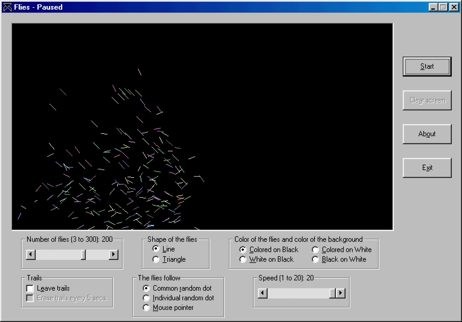



## Flies

### Description

Displays a swarm of flies flying, following local rules to get emerging behavior. The program has several options, such as number of flies, shape of flies, the dot around which the flies try to gather, etc.
 
### More Info
 

             |
---                |---
**Submitted On**   |2001-02-18 16:48:40
**By**             |[Roberto Caballero](https://github.com/Planet-Source-Code/PSCIndex/blob/master/ByAuthor/roberto-caballero.md)
**Level**          |Intermediate
**User Rating**    |4.5 (49 globes from 11 users)
**Compatibility**  |VB 3\.0, VB 4\.0 \(16\-bit\), VB 4\.0 \(32\-bit\), VB 5\.0, VB 6\.0
**Category**       |[Graphics](https://github.com/Planet-Source-Code/PSCIndex/blob/master/ByCategory/graphics__1-46.md)
**World**          |[Visual Basic](https://github.com/Planet-Source-Code/PSCIndex/blob/master/ByWorld/visual-basic.md)
**Archive File**   |[CODE\_UPLOAD151642182001\.zip](https://github.com/Planet-Source-Code/roberto-caballero-flies__1-21130/archive/master.zip)

